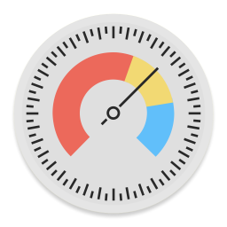

# FreeSpace – macOS Menubar App

Current release: [FreeSpace (Version 0.2.0)](https://github.com/WasAlexHere/FreeSpaceApp/releases/tag/0.2.0)

A simple menubar app to control free disk space on you mac.
Basically, this app displays the current free and total space every 5 seconds.
